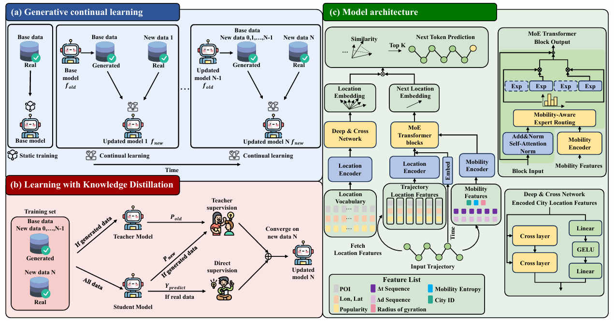

# Breaking Data Silos:Towards Open and Scalable Mobility Foundation Models via Generative Continual Learning
<!-- add image -->
<p align="center">
  
</p>
MoveGCL is a scalable and privacy-preserving framework for training mobility foundation models via generative continual learning. Without sharing raw data, MoveGCL enables decentralized and progressive model evolution by replaying synthetic trajectories generated from a frozen teacher model, and reinforces knowledge retention through a tailored distillation strategy that mitigates catastrophic forgetting. To address the heterogeneity of mobility patterns, MoveGCL incorporates a Mixture-of-Experts Transformer with a mobility-aware expert routing mechanism, and employs a layer-wise progressive adaptation strategy to stabilize continual updates.

## 📊 Data set
### trajectory data
The trajectory data is stored in the `traj_data` directory. Each line in the text files represents a single user's trajectory over three consecutive days, formatted as: 
`1391097 0 8 1104,0,0,0,0;1137,0,9,9,1;1137,1,0,39,0;1137,2,3,51,0;1103,2,17,14,1;1137,2,22,5,1`. 
Where:
- `1391097`: User ID.
- `0`: Quantized radius of gyration (`r_gyr`).
- `8`: Quantized location entropy (`H_loc`).
- Each subsequent entry (e.g., `1104,0,0,0,0`) represents a point in the trajectory with the following format: `location_id, day_of_week, time_slot, t_wait, d_jump` where:
    - `location_id`: Unique identifier of the visited location.
    - `day_of_week`: Day index (0 = Monday, ..., 6 = Sunday).
    - `time_slot`: Index of the time interval within the day.
    - `t_wait`: Waiting time at the location.
    - `d_jump`: Distance jumped from the previous location.

### Location vocabulary
The location vocabulary for each city is stored in the `./location_feature` directory. Each `.npy` file corresponds to one city, where the *n*-th row represents the feature vector for the location with `location_id = n`.Each row is structured as follows:
- [0–33]: Raw POI (Point of Interest) counts across different categories.
- [34–77]: Normalized POI counts for each category.
- [78–79]: Normalized geographic coordinates (latitude and longitude).
- [80]: Mobility heat score, indicating location popularity or activity intensity.

## ⚙️ Installation
### Environment
- Tested OS: Linux
- Python >= 3.11
- torch == 2.0.1
- CUDA == 11.7
### Dependencies
1. Install Pytorch with the correct CUDA version.
2. Use the `pip install -r requirements.txt` command to install all of the Python modules and packages used in this project.
## 🏃 Model Training

### Stage-1 train base model
The code for training the base model is located in `./MoveGCL/train_base_model.py`
```bash
python ./MoveGCL/train_base_model.py \
  --n_embd 512 \
  --n_layer 6 \
  --num_experts 4 \
  --B 16 \
  --city 'WashingtonDC' 'Seattle' 'Atlanta' \
  --train_root '/data0/liuyukun/MoveGCL/traj_data/train' \
  --val_root '/data0/liuyukun/MoveGCL/traj_data/val' \
  --test_root '/data0/liuyukun/MoveGCL/traj_data/test' \
  --epoch 30 \
  --lr 1.2e-5
```
Arguments:
- `n_embd`: The hidden dimension size of the MoE Transformer.
- `n_layer`: Number of layers in the MoE Transformer.
- `num_experts`: Number of experts per layer in the MoE Transformer.
The trained model will be saved in the ./base_model directory.

### Stage-2 Generative continual learning
#### 2.1 Generate pseudo-trajectories
All scripts and data files live under `./GCL_data`.
##### 2.1.1 Build Empirical First-Location Distribution   
Each time you train the model on a new city, you need to extract the empirical distribution of first locations conditioned on trajectory length (refer to Eq. 4 in the paper):
```bash
python ./GCL_data/get_first_loc_distribute.py
```
This script processes the raw trajectories of the target city and saves the resulting distribution to: `./GCL_data/data_distribution/`.
##### 2.1.2 Sample Base Trajectories   
To prepare for pseudo-trajectory generation, sample base trajectories from the new city's dataset by running:
```bash
python ./GCL_data/get_sample_data.py
```
The sampled trajectories will be saved to the directory: `./GCL_data/sampled_data/`.
##### 2.1.3 Replace First Locations   
Inject variability by replacing the first point of each sampled trajectory:
```bash
python ./GCL_data/replace_first_loc.py
```
For each trajectory, this script samples a new first location from the precomputed distribution and replaces the original one. The modified trajectories are saved to `./GCL_data/replaced_first_loc_data/`.
##### 2.1.4 Generate Pseudo-Trajectories
Finally, generate full pseudo-trajectories (refer to Eq. 5 in the paper) by running:
```bash
python ./MoveGCL/GCL_data/gen_pseudo_traj.py
```
This script outputs the synthesized pseudo-trajectories and saves them to `./GCL_data/pseudo_traj/`.

#### 2.2 Retrieve Frequently Selected Experts
Run the following script:
```bash
./get_experts_to_forze.py
```
This will generate a file at <code><model_folder>/froze_info_file/layer_max_indices.txt</code>, which records the most frequently selected expert for each layer. The layers are listed from top (closest to the output) to bottom (closest to the input).

#### 2.3 Continual learning
Code for continual learning is implemented in<code>./MoveGCL/continual_learning.py</code>. You can run it with the following command:
```bash
python ./continual_learning_copy.py \
  --teacher_model 'xxx' \
  --Increm_root './MoveGCL/GCL_data/pseudo_traj/xxx' \
  --city_Incerm 'xxx' \
  --experts_froze '[[0, 1, 2], [0, 1, 3], [1, 2, 3], [1, 2, 3], [1, 3], [0]]' \
  --epoch 30 \
  --B 128 \
  --lr 1.2e-4
```
- `teacher_model`: Path to the pre-trained model f_old.  
- `Increm_root`: Path to the pseudo-trajectories generated in 2.1.   
- `city_Incerm`: Name of the city used in the continual learning phase.   
- `experts_froze`: The list of frequently selected experts obtained in the Retrieve Frequently Selected Experts step. 
